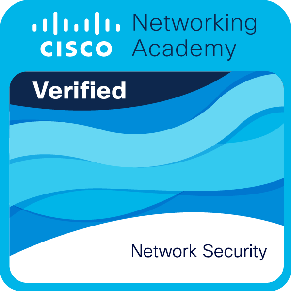
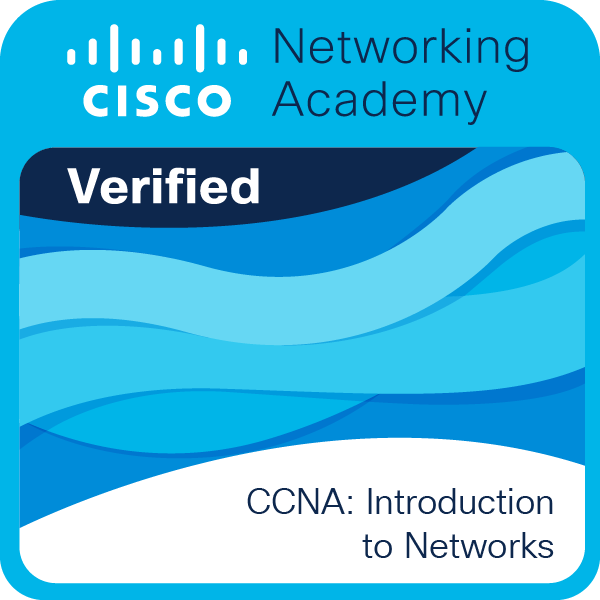
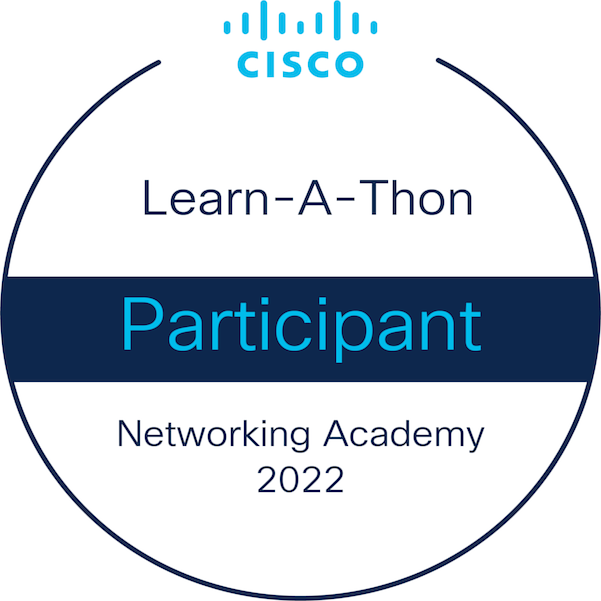

I'm Eric, a developer from  <b>Brazil</b>, currently working as a __Backend Developer__ _@_  [BEES (AB-inBev)](https://www.beesbank.com.br/).

__Curious fact:__  I love coffee.

## 🚀💻 Technologies & Tools
 

  
  

  
  
  
  

  
  
  
    

  
  

  
  
  
  

  
   

  

  

  

   

  
 
  
  
  
  
  

   
  

 
 
  

 
  
 

 

 ## 🎖️🏆 GitHub Trophies
 

  
 ## 🏆🏅 Achievements 
 

  
 
    
   
  
 
 

 

  

 ## 📫 Contact
  
   

   ## 📊📈 Statistics

   
  

